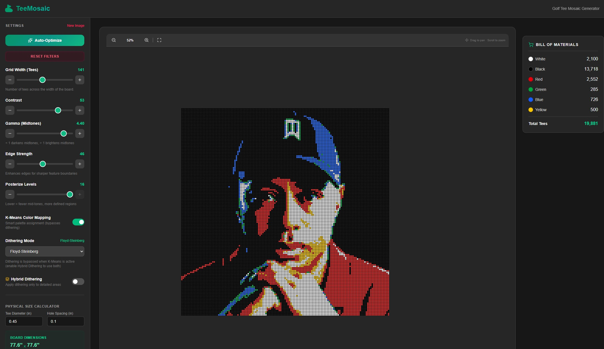

# TeeMosaic



TeeMosaic is a powerful client-side application designed to convert your favorite photos into physical golf tee mosaic blueprints. Built with modern web technologies (Next.js) and optionally running as a native desktop application (Tauri), it provides everything you need to tune, process, and generate detailed instructions for building real-world artwork out of golf tees.

Whether you're an artist looking to plan a physical installation or just a hobbyist looking for a weekend craft project, TeeMosaic makes creating physical pixel art incredibly accessible.

## 🌟 Key Features

### 🎨 Intelligent 6-Color Mapping
TeeMosaic maps your images to a specific palette designed for physical materials: **white, black, red, green, blue, and yellow golf tees**. The application automatically analyzes your photo and decides which tee color best represents each pixel to recreate the original image as faithfully as possible.

### 🎛️ Image Processing & Tuning
Every photo is different, and finding the perfect balance for a 6-color physical mosaic requires tuning. 
- **Contrast & Brightness**: Standard controls to make your subject pop.
- **Midtones (Gamma)**: Advanced adjustment to bring out details in shadows or recover highlights without washing out your entire image.

### 🪄 Advanced Dithering Options
Dithering is a technique used to create the illusion of color depth when you only have a few colors to work with. Think of it as mixing our 6 tee colors to create shading and details. TeeMosaic offers several algorithms, each providing a unique artistic style:
- **Floyd-Steinberg Dithering**: The gold standard. It diffuses errors to neighboring pixels, creating smooth gradients and preserving fine details.
- **Atkinson Dithering**: Popularized by early Apple Macintosh computers, this creates a higher contrast, slightly more "retro" look by leaving some areas completely flat.
- **Ordered (Bayer Matrix) Dithering**: Creates a distinct, uniform cross-hatch or checkerboard pattern that gives a very intentional, stylized look.
- **Hybrid Dithering**: The ultimate smart filter. It uses edge detection to find the "subject" of your photo, applying detailed Floyd-Steinberg dithering to the important parts, while keeping flat backgrounds clean and simple.

### 📏 Physical Size Calculator & Blueprint Generation
TeeMosaic isn't just a digital toy—it's a tool for architects of physical art.
- **Grid Sizing**: Define how many tees wide or tall your mosaic will be. The app maintains your image's aspect ratio automatically.
- **Physical Estimation**: Enter the diameter of your golf tee heads and the spacing between them to calculate exactly how large the final physical piece will be in inches or centimeters.
- **Printable PDF Export**: Export a high-quality, multi-page PDF blueprint. This document acts as your step-by-step instruction manual, showing exactly where to place each tee.
- **Bill of Materials (BoM)**: The app tallies every single tee needed so you know exactly what to buy before you start building.

## 🚀 How to Use TeeMosaic

1. **Upload an Image**: Start by dragging and dropping a photo into the app.
2. **Crop to Fit**: Use the built-in cropping tool to select the exact portion of the image you want to turn into a mosaic.
3. **Set the Size**: Choose how large you want your mosaic to be in the "Control Panel." The larger the grid, the more detail you'll capture, but the more physical tees you'll need!
4. **Tune & Stylize**: 
   - Adjust the brightness, contrast, and midtones to make your subject clear.
   - Play with the different **Dithering Algorithms** to see which style looks best for your specific image.
5. **Generate Blueprint**: Once you're happy with the preview, click the export button. You'll receive a detailed PDF with your Bill of Materials and step-by-step grid layout.
6. **Start Building!**: Gather your supplies, print your blueprint, and start placing tees!

## 💻 Tech Stack

- **Frontend**: [Next.js](https://nextjs.org/) (React), TypeScript, user interface
- **Desktop Framework**: [Tauri](https://tauri.app/) (Rust) for cross-platform executables
- **State Management**: Zustand
- **Image Processing**: Custom Canvas API logic

## 🛠️ Getting Started

### Prerequisites
- Node.js (v18 or later)
- Rust (for building the Tauri desktop application)

### Installation
1. Clone the repository:
   ```bash
   git clone https://github.com/ghise/TeeMosaic.git
   cd TeeMosaic
   ```
2. Install frontend dependencies:
   ```bash
   npm install
   ```

### Running Locally

**Web Version:**
Start the standard development server:
```bash
npm run dev
```
Open [http://localhost:3000](http://localhost:3000) in your browser.

**Desktop Version (Tauri):**
Start the desktop application in development mode:
```bash
npm run tauri dev
```

### Building for Production

**Web Build:**
```bash
npm run build
```

**Desktop Executable:**
```bash
npm run tauri build
```
Once the build is complete, you can find the packaged installer and executable in the `src-tauri/target/release/` directory.

## 📄 License
This project is licensed under the MIT License.
